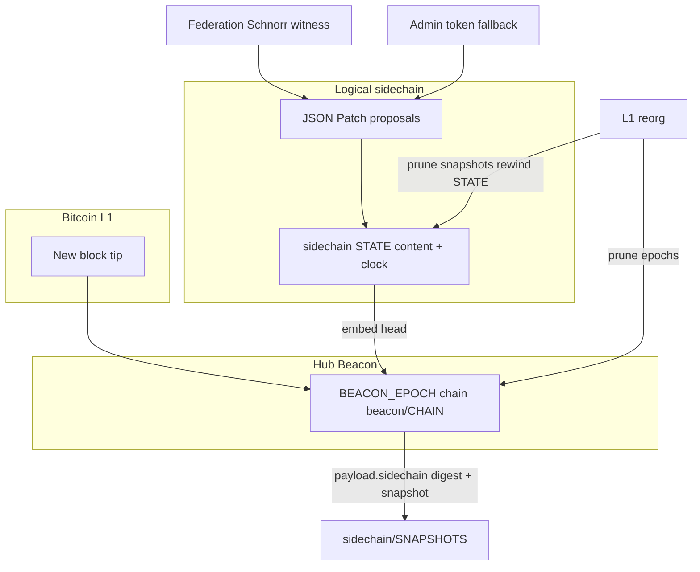

# Beacon, sidechain state, and L1 reorgs — design, status, and roadmap

This document is the **single place** for the overall design of Hub **Beacon epochs** as the “L1 step clock” for a **logical sidechain document**, how **JSON-Patch–style** updates are authorized, how **reorgs** rewind state, and what is **left to build**. It also records **why** we built it and how that intent evolved across discussions in this workspace.

**Related references (deeper detail elsewhere):**

- [ADR-001-CONTRACT_NAMESPACE_SIDECHAINS.md](ADR-001-CONTRACT_NAMESPACE_SIDECHAINS.md) — **accepted** thesis: L1 → Beacon Federation → contract-namespace Statechains via Contract publish
- [DISTRIBUTED_CONTRACT_EXECUTION.md](DISTRIBUTED_CONTRACT_EXECUTION.md) — contracts, federation concept, manifest, signing philosophy
- [SIDECHAIN_AND_EXECUTION_INDEX.md](SIDECHAIN_AND_EXECUTION_INDEX.md) — file map across Hub, `@fabric/core`, tests
- [AGENTS.md](../AGENTS.md) — RPC list, operational notes

---

## 1. Conversation and intent

**Starting point (product intent):** Treat the **Beacon** as a steady sequence of **epochs**—the steps of a contract that defines the **sidechain**. On **mainnet-like** networks, those steps should align with **new blocks** seen by the node’s local Bitcoin instance. **Users** submit updates to **global sidechain state** using operations akin to **JSON Patch** (`op` / `path` / `value`), delivered as **signed Fabric messages** toward **federation** members (threshold Schnorr over a canonical payload), not ad-hoc server trust.

**What we implemented in code (this arc):**

1. **Sidechain document** — `sidechain/STATE`: `{ version, clock, content }` with a monotonic **logical clock** distinct from the beacon’s L1-oriented **epoch counter**.
2. **Patch path** — RFC6902 patches apply to **`content`**; canonical signing string for federation (`SidechainStatePatch` kind) in `functions/sidechainState.js`.
3. **Beacon binding** — Each **`BEACON_EPOCH`** payload includes **`sidechain: { clock, stateDigest }`** so every L1-sealed step commits the **head digest** of the logical document.
4. **Hub RPC** — `GetSidechainState`, `SubmitSidechainStatePatch` (federation witness **or** admin token when no validators are configured).
5. **Distributed manifest** — `SIDECHAIN_STATE_PATCH` added to allowed message types for program expectations.
6. **Beacon completeness** — Implemented missing **`_buildEpochEntry`**, **`_verifyEpochWitnessesIfConfigured`**, **`getFederationPolicy`**, federation attachment in **`attach()`**, and **`epoch`** events now emit the **full committed payload** (including `sidechain`).
7. **L1 reorg** — Per-epoch **full snapshots** in **`sidechain/SNAPSHOTS`** (keyed by **`payload.clock`**); on reorg, prune snapshots and **rewind** `sidechain/STATE` to the surviving tip. Fixed beacon **height prune** semantics to **keep `height <= new tip`** (inclusive), which corrects an off-by-one that could drop the new tip after a depth reorg.

**What the conversation explicitly deferred or only sketched:** P2P ingestion of patch messages as first-class Fabric traffic (beyond RPC), explicit **patch journal** for audit/replay separate from snapshots, UI for operators, and tying **sidechain scan / L1 OP_RETURN** events into proposed patches.

---

## 2. Overall design (one picture)

**Roles:**

| Piece | Role |
|--------|------|
| **Beacon epoch** | Ordered, persisted **steps** tied to L1 height/hash (and wallet balance fields for ops). **Regtest** may also advance on a timer **and** via block/ZMQ dedupe. |
| **`payload.clock`** | Monotonic **beacon epoch id** (not the same as sidechain logical `clock`). Used as snapshot key and reorg accounting. |
| **`sidechain/STATE`** | Current **materialized** global document head for the Hub. |
| **`sidechain/SNAPSHOTS`** | Full state copies **at each sealed epoch** → enables **rewind** without maintaining a separate patch log. |
| **Patches** | Authorized transitions on `content`; **basisClock** must match current sidechain clock to prevent stale application. |

**“Replay” after reorg:** We do **not** currently re-apply an explicit append-only patch list. Rewind = **restore the snapshot** at the last surviving **`BEACON_EPOCH`**. That is equivalent to replaying all sidechain transitions **through** the last kept L1 step, assuming every sealing epoch had a correct snapshot. Patches that never reached a subsequent epoch remain **unsealed** (see §6).

---

## 3. Persistence layout (Hub store)

| Path | Contents |
|------|-----------|
| `beacon/CHAIN` | `{ messages, merkle }` — `BEACON_EPOCH` entries (+ optional `federationWitness`) |
| `sidechain/STATE` | Live `{ version, clock, content }` |
| `sidechain/SNAPSHOTS` | `{ version, byClock: { "<beaconClock>": { version, clock, content } } }` |
| `sidechain/JOURNAL` | Append-only patch transitions; `sealedBeaconClock` set when a Beacon epoch seals |

Writes use the same **Fabric `Filesystem`** as the rest of the Hub (`readFile` / `writeFile` / `publish`).

---

## 4. Authorization model

| Mode | When | Mechanism |
|------|------|-----------|
| **Federation** | `FABRIC_DISTRIBUTED_FEDERATION_VALIDATORS` (or settings) non-empty | `SubmitSidechainStatePatch` requires **`federationWitness`** with threshold Schnorr over **`signingStringForSidechainStatePatch({ basisClock, basisDigest, patches })`**. Same **verify** helper as beacon epochs: `DistributedExecution.verifyFederationWitnessOnMessage`. |
| **Admin fallback** | No validators configured | **`adminToken`** (same family as other Hub admin RPCs). |

Beacon epochs optionally attach **`federationWitness`** over **`signingStringForBeaconEpoch(fullPayload)`** when the Hub identity pubkey is listed as a validator (single-operator demo of multi-validator policy).

---

## 5. Reorg behavior

**Triggers (in `@fabric/core` `types/beacon`; Hub `contracts/beacon.js` is a thin subclass):**

- **Depth reorg:** new tip **height** lower than previous → **`_pruneEpochChain(inclusiveMaxHeight)`** keeps epochs with **`height <= newTip`**, lists **`removedBeaconClocks`**.
- **Same height, different hash:** pop one epoch → **`removedBeaconClocks`** for that entry.

**Hub (`services/hub.js`):**

- Serializes handling with **`_beaconReorgChain`** so sidechain rewind finishes before **`_refreshChainState('beacon-reorg')`**.
- Prunes snapshot keys for removed clocks; **`pruneSnapshotsAfterBeaconClockSync(tipClock)`** drops any snapshot **above** the surviving tip.
- Restores **`_sidechainState`** from **`loadSnapshotForBeaconClock`**, else falls back to **`sidechain/STATE`** if digest matches last epoch’s **`payload.sidechain.stateDigest`**, else **genesis** + warning.
- **`_reconcileSidechainToBeaconTip()`** after **`beacon.start()`** aligns restart with the on-disk beacon tip.

---

## 6. Remaining work (prioritized)

**Near-term (correctness & ops)**

1. ~~**Unsealed patches**~~ — **Done in core/Hub:** `sidechain/JOURNAL` + `resolveStateForBeaconTip` (snapshot → digest-match → genesis, then replay unsealed). Patch submits use `createSerializeQueue`.
2. **Cross-hub replication** — Other federation members need the **same** rules: ingest epochs + patches, store snapshots, run identical reorg logic. Today this is **single-hub** oriented; wire body helpers exist (`encodeSidechainStatePatchMessage`).
3. **P2P wire type** — Submit patches via **`SIDECHAIN_STATE_PATCH`** on Fabric P2P / WebSocket (body helpers in `@fabric/core/functions/sidechainState`; HTTP POST `/services/distributed/sidechain/patches` available). Dedicated outer opcode still pending.
4. **Tests** — Unit coverage for journal/restore/policy; expand integration reorg + RPC.

**Medium-term (product & audit)**

5. ~~**Explicit patch journal**~~ — **Done:** `sidechain/JOURNAL`.
6. **UI** — Surface sidechain JSON, patch submission, digest vs last epoch, reorg warnings.
7. **L1 scanner linkage** — `functions/sidechainBlockScan.js` / deposit signals → **proposed** patches or epoch fields (inventory still documented as future in the index).
8. **Multi-sign UX** — Collect threshold sigs for patches/epochs via delegation / desktop signing flows already used for execution contracts. **Epoch rounds:** `FederationSignRequest` broadcast + RPC `SubmitBeaconEpochSignature` / `ListPendingBeaconEpochSignatures` (ADR-001). Hub `contracts/beacon.js` **idempotently finalizes** already-`ready` rounds if persist failed (does not reopen for new sigs).

**Longer-term**

9. **Formal relation to `Contract` type** — Promote sidechain state machine into Fabric **`Contract`** semantics where appropriate.
10. ~~**Policy on paths**~~ — **Done in core:** `sidechainPolicy` on distributed manifest (`allowedPathPrefixes`, `deniedPathPrefixes`, `maxOps`, `maxPathDepth`); Hub via `settings.distributed.sidechainPolicy` / `FABRIC_SIDECHAIN_*` env.

---

## 7. Design risks and assumptions

- **Single writer:** The Hub instance is assumed authoritative for its store; **Byzantine** federation members are out of scope until multi-node replication exists.
- **Snapshot size:** Full JSON per epoch is simple but grows with epoch count; sharding or periodic **checkpoint + journal** may be needed for very long chains.
- **Digest vs snapshot:** If snapshots are missing but **`STATE`** matches the last epoch digest, we trust **`STATE`**; otherwise we reset to genesis — operators should **back up** `sidechain/` alongside `beacon/`.

---

## 8. Key source files (quick index)

| File | Responsibility |
|------|------------------|
| `contracts/beacon.js` | Hub Beacon subclass of `@fabric/core` `types/beacon` (epoch chain, reorg prune, fail-closed witnesses) plus retry-finalize for already-`ready` federation rounds |
| `functions/sidechainState.js` | Re-exports `@fabric/core/functions/sidechainState` (vendored `fabricStatechain.js` fallback) |
| `@fabric/core/functions/sidechainState` | Digests, patch + path policy, journal, restore, serialize queue, wire body helpers |
| `services/hub.js` | RPC + HTTP sidechain routes, epoch snapshot + journal seal, reorg/reconcile via `resolveStateForBeaconTip` |
| `types/distributedExecution.js` | **Deprecated** thin re-export — use `functions/beaconFederationSigning` + `Machine`/`Program` |
| `tests/beacon.reorg.test.js`, `tests/sidechainState.test.js` | Unit coverage |

---

## 9. Changelog of ideas in this document

| Topic | Outcome |
|-------|---------|
| Epochs as sidechain steps | **Done** — epochs carry `sidechain` head; mainnet path = per block |
| JSON Patch global state | **Done** — `SubmitSidechainStatePatch` on `content` |
| Federation-signed patches | **Done** — witness over canonical string |
| Reorg-safe sidechain | **Done** — snapshots + rewind + inclusive height fix |
| Journal + unified restore | **Done** — `sidechain/JOURNAL` + `resolveStateForBeaconTip` |
| Path policy (contract rules) | **Done** — manifest `sidechainPolicy` / Hub settings + env |
| Fail-closed epoch witnesses | **Done** — Beacon truncates invalid prefix by default |
| Fabric message storage / “client patterns” | **Partial** — HTTP + body helpers; P2P ingest not fully wired |
| Full distributed replay across peers | **Not done** — documented as remaining work |
| Contract-namespace Statechains via CONTRACT_PUBLISH | **Done (ADR-001)** — `sidechains/<id>/` + parent `/namespaces/<id>`; federation epoch sign rounds |
| Application / Group namespaces | **Done (client + Hub)** — application D-016-style namespace trees |

---

*Last updated to reflect the Beacon + sidechain + reorg implementation in `hub.fabric.pub` and the design discussions that motivated it.*
