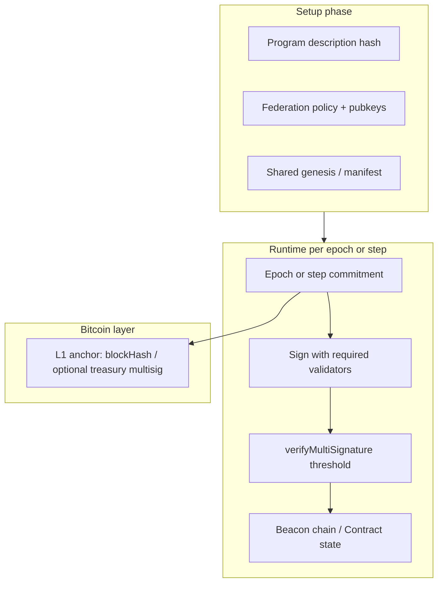

# Distributed contract execution: Contract, Federation, Beacon, and signing
This document captures the **core idea**: a **Contract** (Fabric type) is the shared coordination primitive for **multiple node operators** running a **known program**—steps and behaviors are fixed at setup, so every peer can **predict which messages may appear** and **reject** anything that does not match. **Bitcoin** supplies the ultimate security anchor (funds, multisig policy, optional L1 checkpoints). **Sign-in and delegation** stay narrow: operators authenticate, then receive **targeted signing requests** only when their key participates in that round—supporting **signature aggregation** without a bespoke protocol per app.

**Workspace map (sidechain + execution examples, Fabric playnet tests, stubs):** [SIDECHAIN_AND_EXECUTION_INDEX.md](SIDECHAIN_AND_EXECUTION_INDEX.md).

---

## 1. What “program” means here
| Layer | Role |
|-------|------|
| **Program** (`@fabric/core` `types/program`) | Multi-language artifact (`fabric-opcodes`, `javascript`, `bitcoin-script`, …) with `programHash`; Machine loads/runs it. See core `docs/PROGRAM.md`. |
| **Program description** | A stable artifact: opcode list, state machine, or DOT graph (see `Contract` / execution machine in Hub). Everyone loads the **same** description at join. |
| **Setup phase** | Agree on: program hash, participant set (pubkeys / Fabric ids), thresholds, epoch or step schedule, and any **shared genesis** (merkle root of empty state, federation id, etc.). |
| **Runtime** | Only **typed Fabric messages** whose shape matches the program advance state. Peers verify **type + payload + signatures** before applying. |

**Note:** There is **no** `DistributedExecution` Fabric type — helpers are `functions/fabricCanonicalJson`, `functions/beaconFederationSigning`, and `Machine.parseManifest`.

**Security property:** verification is **local**—no silent trust in a single leader. If a message is not among the expected set for the current step, it is dropped.

---

## 2. Contract as the type for distributed exec
In `@fabric/core`, **`Contract`** extends **`Service`** and holds structured state, events, and a key for the contract identity. It is the right umbrella for:

- Ordered **steps** (execution trace).
- **Witnesses** and **signatures** attached to transitions.
- JSON-Patch or event-sourced updates so all nodes can **replay** the same transitions given the same ordered inputs.

A **distributed** contract run means: **each operator runs the same Contract logic**; they only accept transitions that are **signed by the right parties** for that step (see §5).

---

## 3. Federation: Bitcoin-oriented multisig + aggregation
The **`Federation`** type (`@fabric/core/types/federation`) models a fixed set of **validators** (compressed secp256k1 pubkeys) and Miniscript-style **policy** (e.g. *k-of-n* over `pk(A)…pk(E)`). It provides:

- **`sign(msg, pubkey)`** — sign with a **specific** member when that operator holds the private key.
- **`createMultiSignature(msg)`** — collect one signature per available key (building block for **aggregation** workflows).
- **`verifyMultiSignature(multiSig, threshold)`** — count valid BIP340 Schnorr signatures over the **same** message hash.

**Mapping to “epochs”:** treat each **epoch** (or step) as a **canonical byte string** `epoch_commitment` (e.g. hash of `{ epochId, merkleRoot, blockHash }`). The federation signs `epoch_commitment`; verifiers check threshold **before** treating the epoch as final for contract state.

This is how **multiple node operators** share enforcement: the **policy** is known at setup; **who must sign** per round can rotate (see `validatorNumberForStep` / `contractForStep` in `Federation`) or follow a fixed schedule—your program description should say which.

---

## 4. Beacon: example chain of epochs (today and federation-shaped)
The Hub **`Beacon`** (`contracts/beacon.js`) appends **`BEACON_EPOCH`** Fabric messages to a persisted chain (`beacon/CHAIN`), with a **merkle root** over entries. Each epoch payload includes **clock, blockHash, height, balance, timestamp**, and (when sidechain state is enabled) **`sidechain: { clock, stateDigest }`** — the logical **head** of the JSON document stored at **`sidechain/STATE`** after RFC6902-style patches (`functions/sidechainState.js`, RPC **`GetSidechainState`** / **`SubmitSidechainStatePatch`**). On **mainnet-like** networks the Beacon advances **once per new block** from the local `bitcoind`; on **regtest** it may use a timer plus block events. Patches are authorized either by a **federation Schnorr witness** (same pattern as epoch witnesses) or, when no federation validators are configured, by **admin token**.

**Today:** epochs are signed with the **Hub identity key** (`message.signWithKey(this.key)`), i.e. a **single** operator key. When **`FABRIC_DISTRIBUTED_FEDERATION_VALIDATORS`** (or settings) lists compressed pubkeys and the Hub key is among them, an optional **`federationWitness`** is attached and verified on load (`DistributedExecution.verifyFederationWitnessOnMessage`).

**L1 reorg:** when the beacon epoch chain prunes (lower tip height or same-height different hash), the Hub drops **`sidechain/SNAPSHOTS`** entries for removed **`BEACON_EPOCH` `payload.clock`** values and reloads **`sidechain/STATE`** from the snapshot at the surviving tip (or genesis if missing). Deep reorg pruning uses **inclusive max height** (`height <= new tip`). Each new epoch persists a full sidechain state copy keyed by beacon clock (sync `writeFile`, same Fabric store as `beacon/CHAIN`).

**Demonstrative extension (example):**
1. **Setup:** instantiate a **`Federation`** with the same validator pubkeys as production signers; publish the federation id + policy hash next to the program description.
2. **Per epoch:** compute `epoch_commitment = SHA256(canonical(epoch_payload))` (or sign the same canonical string used today).
3. **Signing:** instead of only the Hub key, use **`createMultiSignature(epoch_commitment)`** or request signatures only from operators **due** this round (`sign(msg, validatorPubkey)`).
4. **Validation:** store **`multiSig`** (map pubkey → sig) on the epoch record; peers run **`verifyMultiSignature(multiSig, k)`** before accepting the epoch into contract state.
5. **Bitcoin link:** keep **`blockHash` / height** in the payload so epochs remain **anchored to L1**; federation policy can mirror a **taproot/multisig** wallet that holds covenant or treasury funds if the program requires it.

That gives a **concrete** path from “single Hub beacon” to “federation-validated epochs” without changing the **message type**—only the **witness** attached to `BEACON_EPOCH` grows to include threshold signatures.

---

## 5. Message expectations: what each peer checks
At setup, distribute a **manifest** (could be a small JSON document hashed at join):

- Program id + content hash.
- List of **allowed outer message types** per step (or per epoch).
- For each type: required fields, signature requirements (which pubkey or threshold).
- Federation / Contract id.

At runtime, for every inbound message:

1. **Type** allowed for current step?
2. **Payload** schema matches?
3. **Signatures** verify against manifest (single signer, federation threshold, or Hub oracle attestation as appropriate)?
4. Optional: **L1** check (tx confirmed, amount, script path) if the step is payment-bound.

Reject otherwise—**no state transition**.

---

## 6. Sign-in, delegation, and “your signature is required”
Keep **operator auth** separate from **contract signing**:

- **Auth:** existing Hub/session patterns (tokens, local desktop pairing, etc.).
- **Contract signing:** when step *s* requires validator *V*, only *V*’s node should produce a signature over the step commitment.

The Hub already uses a **delegation-style** flow for browser ↔ desktop signing: Fabric messages `DELEGATION_SIGNATURE_REQUEST` / `DELEGATION_SIGNATURE_RESOLUTION` and RPC (`PostDelegationSignatureMessage`, …) with an audit trail (`functions/fabricDelegation.js`).

**Streamlined pattern for federation rounds:**
1. Leader or scheduler broadcasts **`FEDERATION_SIGN_REQUEST`** (or re-use delegation envelope with `purpose: 'federation_epoch'`) containing `epoch_commitment`, `requiredPubkeys`, `deadline`.
2. Only clients that **hold** the requested key show a **signing prompt** (notification).
3. Collect signatures; run **`verifyMultiSignature`**; append epoch to Beacon chain **or** advance Contract state.

**Aggregation:** `createMultiSignature` collects partial sigs; at threshold, publish the **aggregated witness** once—downstream peers verify once using the federation object (no need to verify each partial on every node if the bundle is threshold-valid—your security target chooses “all verify partials” vs “trust threshold bundle”; for maximally strict, everyone verifies partials).

---

## 7. End-to-end mental model

---

## 8. Implementation status (Hub + Fabric)
1. **Manifest + epoch HTTP:** `@fabric/http` exposes `FabricDistributedExecutionHTTP` (`GET /services/distributed/manifest`, `GET /services/distributed/epoch` on Hub).
2. **`@fabric/core` `DistributedExecution`:** canonical signing string, commitment digest, `verifyFederationWitnessOnMessage`, `parseDistributedManifestV1`.
3. **Beacon:** optional `federationWitness` on each `BEACON_EPOCH` chain entry when `FABRIC_DISTRIBUTED_FEDERATION_VALIDATORS` is set; verification on load.
4. **Playnet L1 sync:** `@fabric/core` `Bitcoin` applies `p2pAddNodes` / `FABRIC_BITCOIN_P2P_ADDNODES` via RPC `addnode` after RPC is ready (non-mainnet by default). Hub lists peers in `settings/local.js` — see [BITCOIN_NETWORKS.md](../BITCOIN_NETWORKS.md).
5. **Sidechain signals (optional):** Hub `functions/sidechainBlockScan.js` on each new block tip when `sidechainScan.enable` or `FABRIC_SIDECHAIN_SCAN=1`; federation withdrawal maturation (e.g. +100 blocks) remains explicit policy on heights reported by the scanner.
6. **Pending / next:** operator notifications via `PostDelegationSignatureMessage` for missing cosigners; optional L1 covenant tied to federation policy; promote sidechain state + scan rules into `@fabric/core` when schemas stabilize.

This keeps the **user-visible** story simple: **one program, one federation policy, predictable messages, Bitcoin-backed epochs, and signing prompts only when your key is in the round.**

---

## References (code)
| Piece | Location |
|-------|----------|
| `DistributedExecution` | `@fabric/core/types/distributedExecution` |
| `FabricDistributedExecutionHTTP` | `@fabric/http/types/distributedExecutionHttp` |
| `Federation` | `@fabric/core/types/federation` (Fabric repo) |
| `Contract` | `@fabric/core/types/contract` |
| `Beacon` (Hub) | `contracts/beacon.js` |
| Delegation / signing requests | `functions/fabricDelegation.js`, RPC in `services/hub.js` |
| Execution contracts | `functions/fabricExecutionMachine.js`, `functions/executionRunCommitment.js`, `CreateExecutionContract` / `RunExecutionContract` / `AnchorExecutionRunCommitment` (regtest); UI: `components/ContractView.js` |

### Environment (Hub)
| Variable | Purpose |
|----------|---------|
| `FABRIC_DISTRIBUTED_HTTP_ENABLE` | Set `false` to disable `/services/distributed/*` |
| `FABRIC_DISTRIBUTED_FEDERATION_VALIDATORS` | Comma-separated pubkey hex — enables `federationWitness` on epochs |
| `FABRIC_DISTRIBUTED_FEDERATION_THRESHOLD` | Minimum valid signatures (default `1`) |
| `FABRIC_DISTRIBUTED_PROGRAM_ID` / `FABRIC_DISTRIBUTED_PROGRAM_HASH` | Manifest overrides |
