# Hub UI user flows

Reproducible screenshot gallery for Document Exchange, Fabric P2P, and other Hub surfaces.

## Regenerate

```bash
npm run puppeteer:install-chrome   # once
npm run screenshots                # UI tier
npm run screenshots:l1             # UI + L1 (needs bitcoind)
```

Last capture: `2026-09-03T18:02:25.460Z` · L1 tier included.

<!-- BEGIN GENERATED GALLERY -->

## 1. Document Exchange

Create, publish, list, and peer-inventory paths for Hub document exchange. L1 inventory HTLC fund/confirm shots require `npm run screenshots:l1` (bitcoind).

### Documents list

Hub document catalog before creating a file.

- **id:** `01-documents-empty`
- **tier:** `ui`
- **status:** captured


### Create document

Create Document form for a named text blob.

- **id:** `02-document-create`
- **tier:** `ui`
- **status:** captured

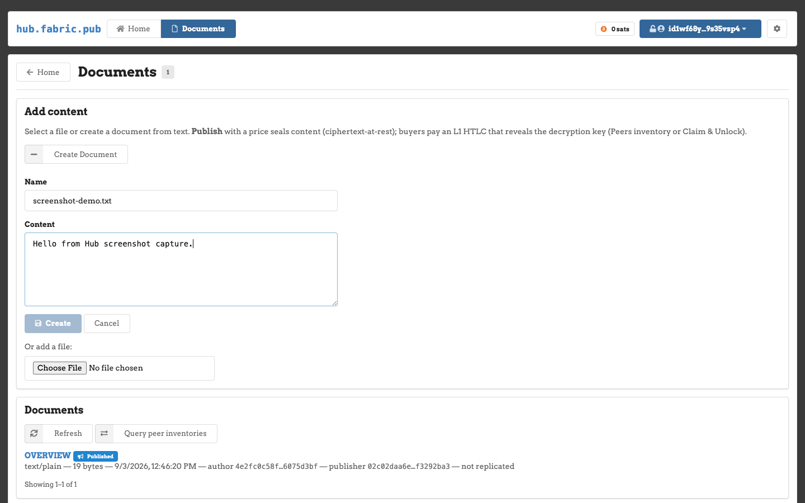

### Published document row

List row after CreateDocument + PublishDocument (priced).

- **id:** `03-document-published`
- **tier:** `ui`
- **status:** captured

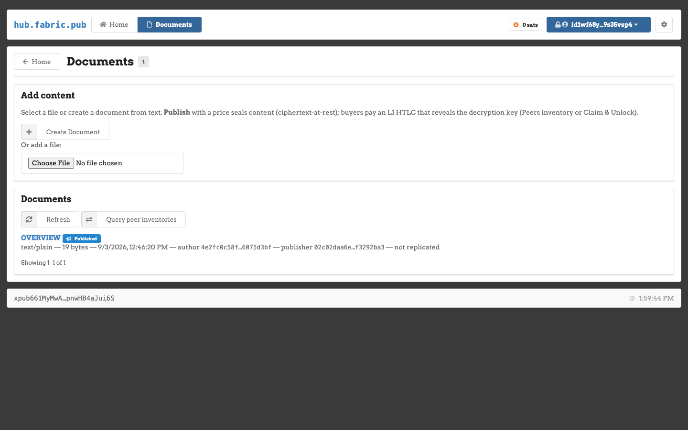

### Document detail

Document view with publish / claim chrome.

- **id:** `04-document-view`
- **tier:** `ui`
- **status:** captured

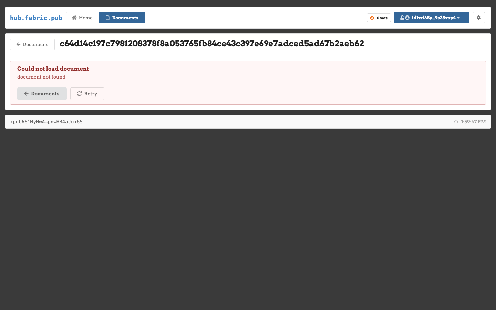

### Document market strip

Inventory / market hints on the Documents page when present.

- **id:** `05-market-strip`
- **tier:** `ui`
- **status:** captured

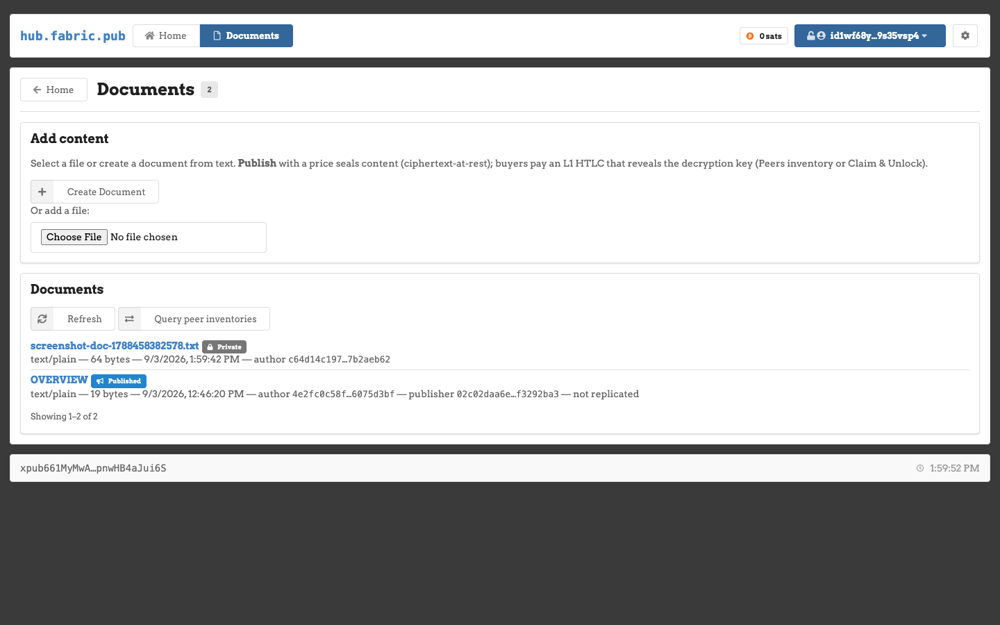

### Peer inventory panel

Peer detail inventory section (HTLC panel when quotes exist).

- **id:** `06-peer-inventory`
- **tier:** `ui`
- **status:** captured


### Inventory HTLC fund

P2TR HTLC quote with BIP21 URI / Pay Now (L1).

- **id:** `07-htlc-fund`
- **tier:** `l1`
- **status:** captured

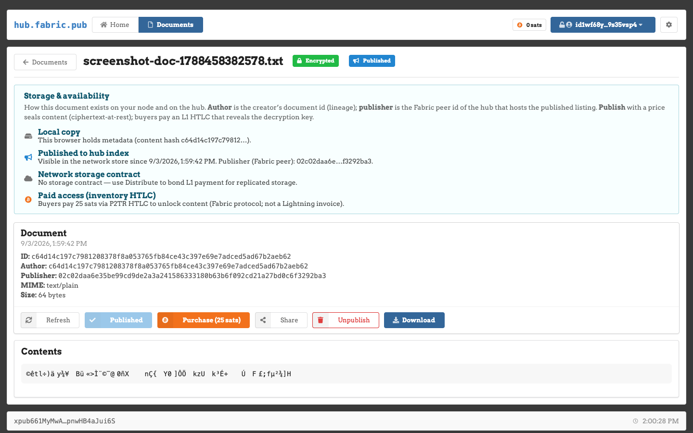

### Inventory HTLC confirm

Confirm funded HTLC / unlock delivery state (L1).

- **id:** `08-htlc-confirm`
- **tier:** `l1`
- **status:** captured

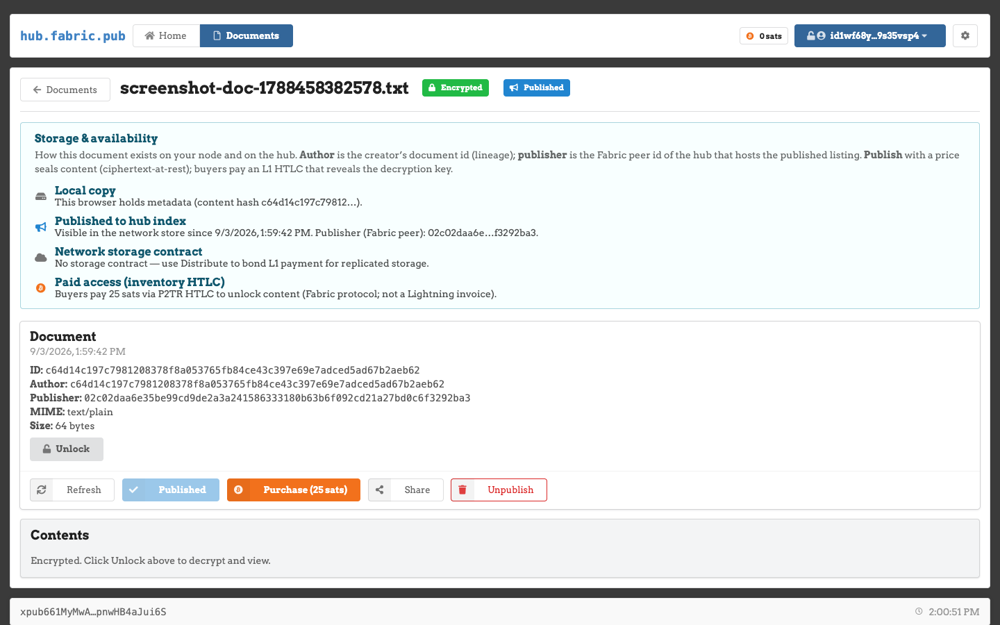

## 2. Fabric Peer-to-Peer network

Peers list, add-peer, detail, chat, WebRTC discover, and topology.

### Peers list

Fabric Peer roster and peering chrome.

- **id:** `01-peers-list`
- **tier:** `ui`
- **status:** captured

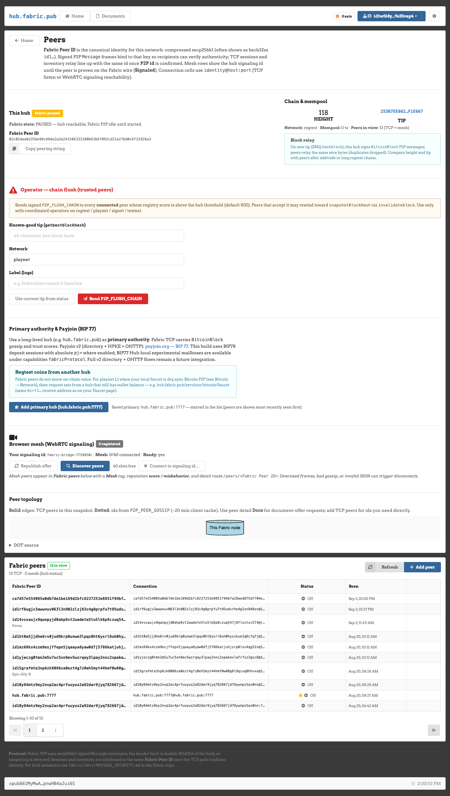

### Add peer modal

Dial a Fabric host:port peer.

- **id:** `02-add-peer`
- **tier:** `ui`
- **status:** captured

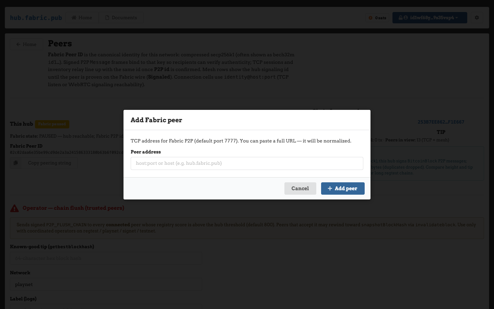

### Peer detail

Inspect a single peer (chat, inventory, federation).

- **id:** `03-peer-detail`
- **tier:** `ui`
- **status:** captured


### Peer chat

Direct peer chat pane when a peer row is open.

- **id:** `04-peer-chat`
- **tier:** `ui`
- **status:** captured

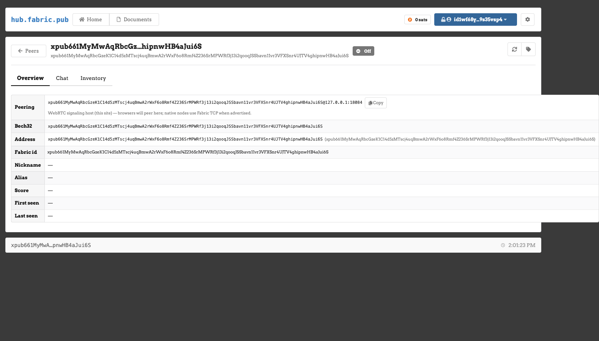

### WebRTC discover

Browser mesh signaling / Discover peers controls.

- **id:** `05-webrtc-discover`
- **tier:** `ui`
- **status:** captured


### Peer topology

Topology / gossip view on the Peers page when rendered.

- **id:** `06-topology`
- **tier:** `ui`
- **status:** captured


## 3. Other features

Home, Features, Downloads, activity/notifications, Bitcoin stack, contracts, sidechain/Beacon, and settings.

### Home

Hub client home / identity entry.

- **id:** `01-home`
- **tier:** `ui`
- **status:** captured

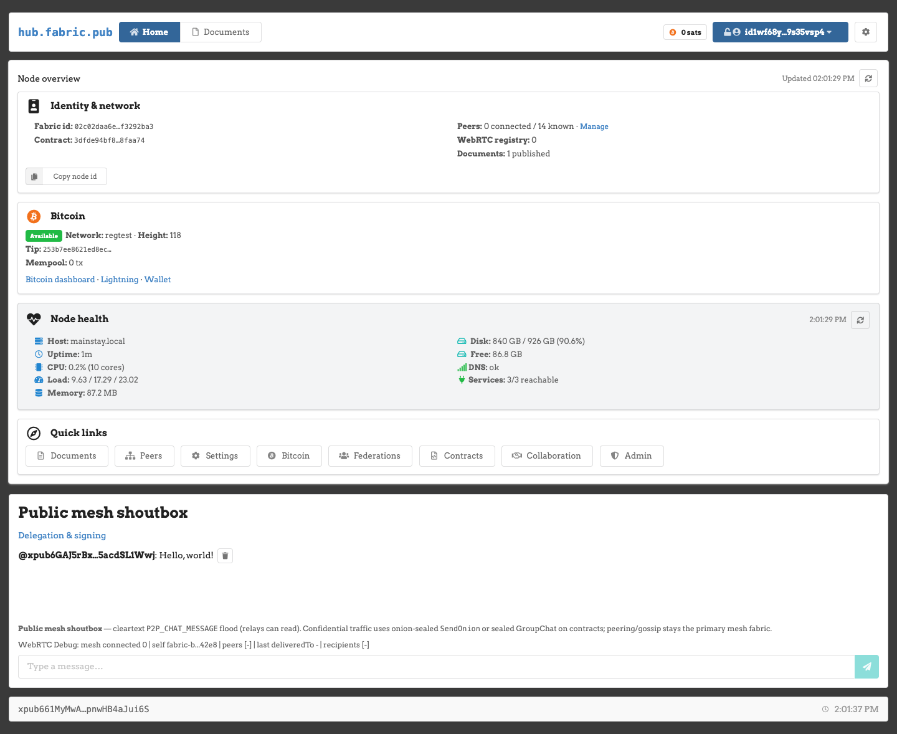

### Features

In-app Features tour and shortcuts.

- **id:** `02-features`
- **tier:** `ui`
- **status:** captured

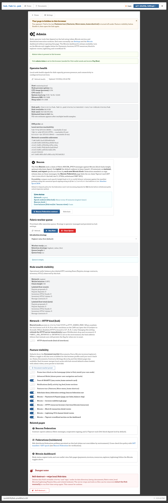

### Downloads

Installer / FileBrowser catalog.

- **id:** `03-downloads`
- **tier:** `ui`
- **status:** captured

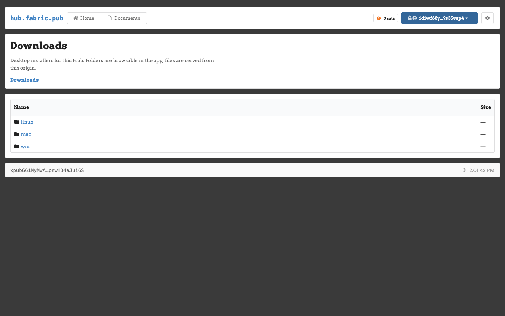

### Activities

Activity stream.

- **id:** `04-activities`
- **tier:** `ui`
- **status:** captured


### Notifications

Notifications history.

- **id:** `05-notifications`
- **tier:** `ui`
- **status:** captured

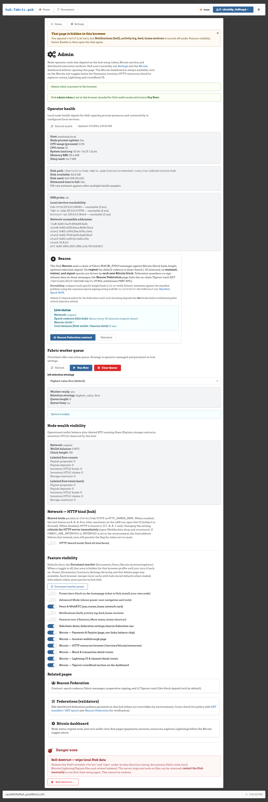

### Bitcoin dashboard

Bitcoin service home (regtest / operator tooling when enabled).

- **id:** `06-bitcoin`
- **tier:** `ui`
- **status:** captured

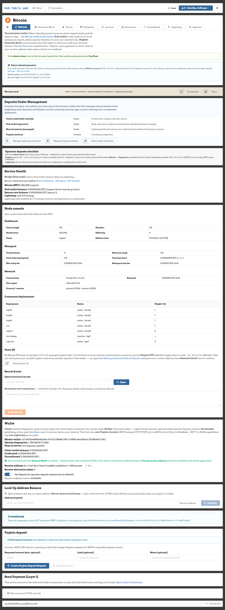

### Payjoin

Payjoin deposit / payments board chrome.

- **id:** `07-payjoin`
- **tier:** `ui`
- **status:** captured


### Payjoin (L1 live)

Payjoin board with live sessions when Bitcoin is available.

- **id:** `07b-payjoin-l1`
- **tier:** `l1`
- **status:** captured

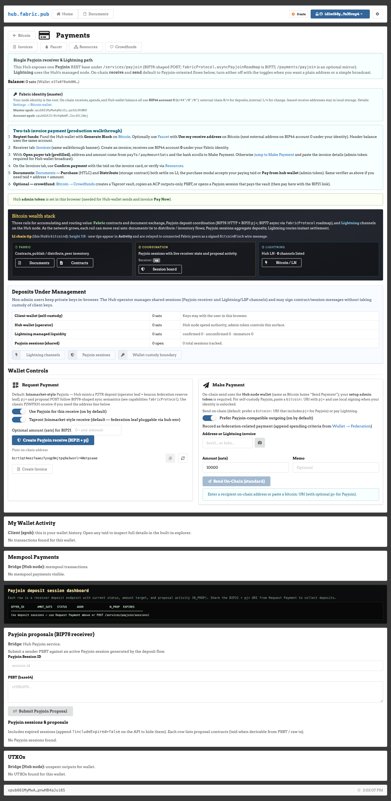

### Crowdfunds

Crowdfund campaigns page.

- **id:** `08-crowdfunds`
- **tier:** `ui`
- **status:** captured

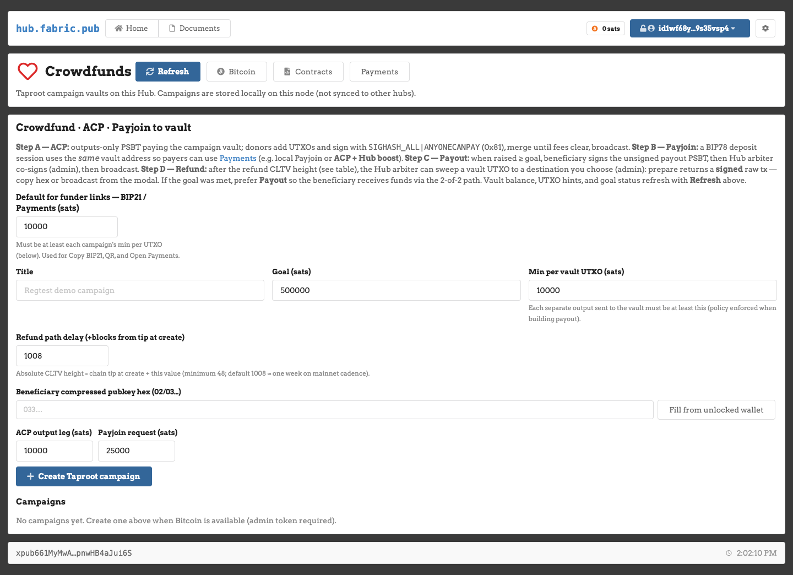

### Crowdfunds (L1 live)

Crowdfund page with Bitcoin vault tooling when L1 is up.

- **id:** `08b-crowdfunds-l1`
- **tier:** `l1`
- **status:** captured


### Contracts

Execution / storage contracts list.

- **id:** `09-contracts`
- **tier:** `ui`
- **status:** captured

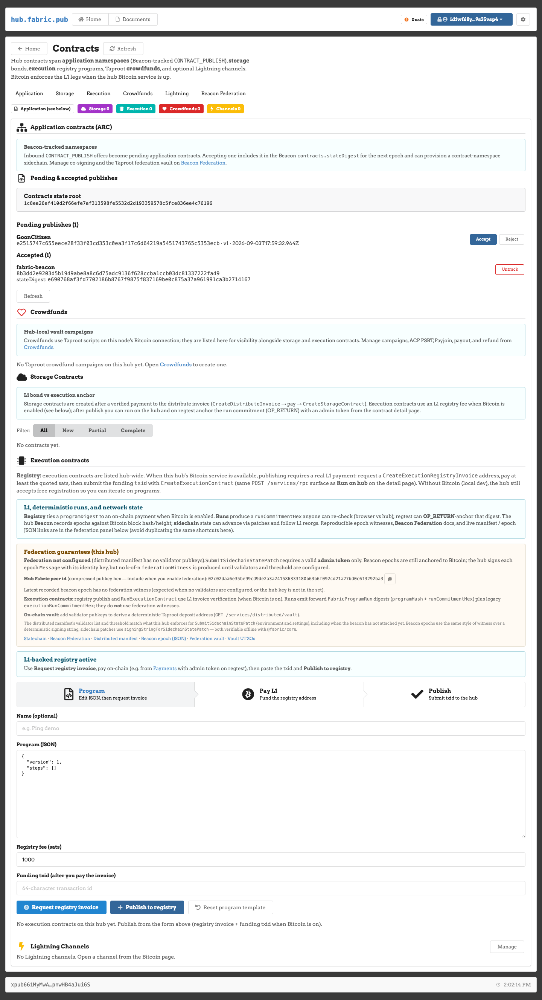

### Sidechains

Sidechain / Beacon-related operator surface.

- **id:** `10-sidechains`
- **tier:** `ui`
- **status:** captured

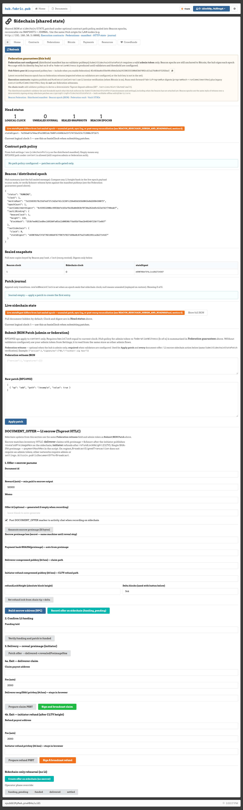

### Beacon Federation

Admin Beacon Federation settings.

- **id:** `11-beacon-federation`
- **tier:** `ui`
- **status:** captured

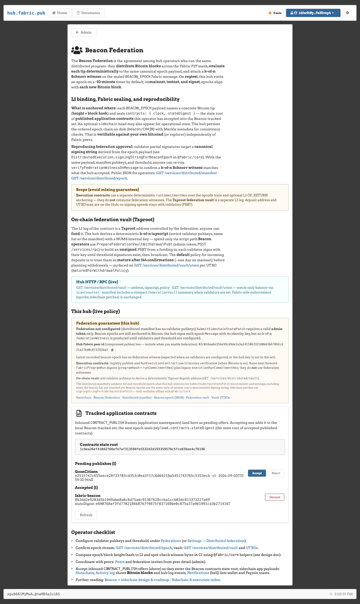

### Settings

Settings home.

- **id:** `12-settings`
- **tier:** `ui`
- **status:** captured

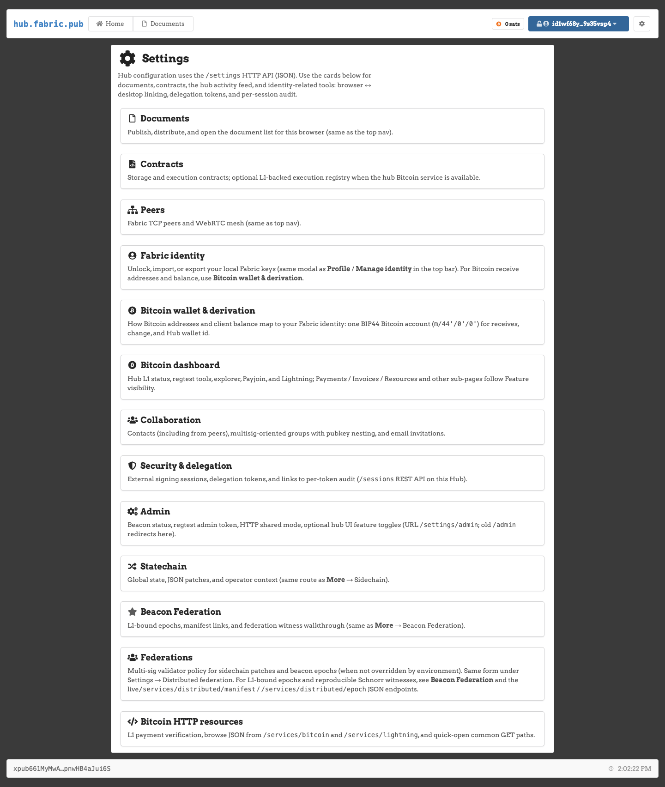

### Security

Settings → Security (sessions / keys).

- **id:** `13-security`
- **tier:** `ui`
- **status:** captured

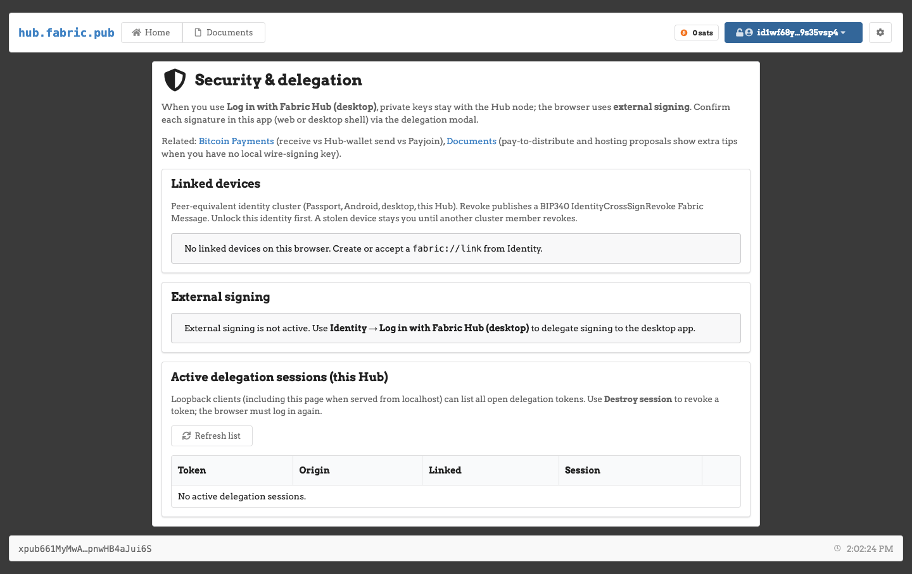

<!-- END GENERATED GALLERY -->
